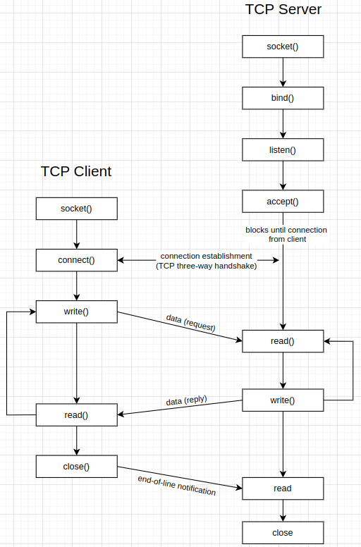
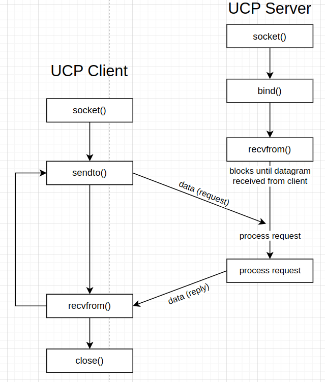

# Theory network-programing

# Kiến thức cơ bản về socket

Socket là một cặp thông tin (four-tuple) xác định hai đầu mối của một kết nối mạng, bao gồm:

- Địa chỉ IP cục bộ và cổng cục bộ (the local IP address & local port)
- Địa chỉ IP từ xa và cổng từ xa (foreign IP address & foreign port)

Trong đó, một địa chỉ IP và số cổng là những yếu tố quan trọng để định danh điểm kết nối. Các giá trị này cho phép ứng dụng định danh chính xác nơi dữ liệu cần được gửi đến hoặc nhận về. Một địa chỉ IP (IP address) kèm môt sô cổng (port) thường được gọi là `socket`.

## Số cổng TCP và các máy chủ đồng thời
Số cổng TCP là thành phần chính để định danh dịch vụ mạng (vd. HTTP, FTP) và hỗ trợ thiết lập các kết nối đồng thời trên một máy chủ, cho phép nhiều kết nối được duy trì cùng lúc.

## Kích thước bộ đệm và giới hạn

Kích thước tối đa của datagram IPv4 là 65,538 bytes.

MTU (Maximum Transmission Unit): kích thước tối đa của một gói tin trên liên kết. Nếu datagram vượt quá MTU, sẽ phải phân mảnh.

MSS (Maximum Segment Size): Thông báo cho bên đối tác biết dung lượng tối đa của dữ liệu TCP mà bên đó có thể gửi mỗi phân đoạn.

`MSS = MTU – fixed size of headers of IP and TCP`

# Socket API

Socket API cung cấp các chức năng chính cho lập trình socket, bao gồm cấu trúc địa chỉ, các hàm chuyển đổi địa chỉ và hàm thao tác dữ liệu.

## Cấu trúc địa chỉ socket

Ví dụ cấu trúc `sockaddr_in` trong **IPv4** được định nghĩa trong thư viện `<netinet/in.h>`. Các lập trình viên sử dụng `sockaddr_in` để thiết lập các tham số của kết nối như địa chỉ IP và cổng.

```c
struct in_addr {
    in_addr_t s_addr;        /* Địa chỉ IPv4 32-bit */
                             /* Theo thứ tự byte của mạng */
};

struct sockaddr_in {
    uint8_t       sin_len;    /* Độ dài của cấu trúc (16 byte) */
    sa_family_t   sin_family; /* AF_INET */
    in_port_t     sin_port;   /* Số cổng TCP hoặc UDP 16-bit */
                              /* Theo thứ tự byte của mạng */
    struct in_addr sin_addr;  /* Địa chỉ IPv4 32-bit */
                              /* Theo thứ tự byte của mạng */
    char          sin_zero[8]; /* Không sử dụng */
};
```

**Trong đó:**

### Datatypes required by the POSIX specification

| Datatype      | Description                                       | Header              |
|---------------|---------------------------------------------------|---------------------|
| `int8_t`      | Signed 8-bit integer                              | `<sys/types.h>`     |
| `uint8_t`     | Unsigned 8-bit integer                            | `<sys/types.h>`     |
| `int16_t`     | Signed 16-bit integer                             | `<sys/types.h>`     |
| `uint16_t`    | Unsigned 16-bit integer                           | `<sys/types.h>`     |
| `int32_t`     | Signed 32-bit integer                             | `<sys/types.h>`     |
| `uint32_t`    | Unsigned 32-bit integer                           | `<sys/types.h>`     |
| `sa_family_t` | Address family of socket address structure        | `<sys/socket.h>`    |
| `socklen_t`   | Length of socket address structure, normally `uint32_t` | `<sys/socket.h>`    |
| `in_addr_t`   | IPv4 address, normally `uint32_t`                 | `<netinet/in.h>`    |
| `in_port_t`   | TCP or UDP port, normally `uint16_t`              | `<netinet/in.h>`    |

### Address families in `sys/socket.h`

| Define         | Value | Description                                    |
|----------------|-------|------------------------------------------------|
| `AF_UNSPEC`    | 0     | Unspecified                                    |
| `AF_LOCAL`     | 1     | Local to host (pipes, portals)                 |
| `AF_UNIX`      | `AF_LOCAL` | Backward compatibility                    |
| `AF_INET`      | 2     | Internetwork: UDP, TCP, etc.                   |
| `AF_IMPLINK`   | 3     | ARPANET IMP addresses                          |
| `AF_PUP`       | 4     | PUP protocols (e.g., BSP)                      |
| `AF_CHAOS`     | 5     | MIT CHAOS protocols                            |
| `AF_NS`        | 6     | Xerox NS protocols                             |
| `AF_ISO`       | 7     | ISO protocols                                  |
| `AF_OSI`       | `AF_ISO` | Same as `AF_ISO`                            |
| `AF_ECMA`      | 8     | European Computer Manufacturers                |

## Value-Result Arguments

Khi truyền một cấu trúc địa chỉ socket vào một hàm socket, nó luôn được truyền bằng tham chiếu. Điều này có nghĩa là hàm sẽ nhận một con trỏ đến cấu trúc thay vì tạo một bản sao.

Điều này giúp tiết kiệm bộ nhớ và cho phép hàm sửa đổi dữ liệu trong cấu trúc nếu cần thiết (đặc biệt trong các hàm như accept và recvfrom).

Chiều dài của cấu trúc địa chỉ cũng được truyền dưới dạng một tham số. Điều này đảm bảo rằng hàm biết được kích thước của cấu trúc và có thể xử lý nó một cách chính xác.

### Hai chiều dữ liệu:

`Process → Kernel`: Ở đây, dữ liệu được truyền từ tiến trình người dùng (user process) vào kernel. Ví dụ trong các hàm như bind, connect, và sendto, cấu trúc địa chỉ được cung cấp từ ứng dụng và truyền vào kernel để thiết lập thông tin kết nối.

`Kernel → Process`: Ở đây, dữ liệu được truyền từ kernel trở lại tiến trình người dùng. Ví dụ trong các hàm accept, recvfrom, getsockname, và getpeername, kernel sẽ ghi thông tin vào cấu trúc địa chỉ và trả lại cho ứng dụng để ứng dụng biết được thông tin về kết nối hiện tại hoặc đối tác.

## Các hàm chuyển đổi địa chỉ


Các hàm này giúp chuyển đổi địa chỉ IP giữa **chuỗi ASCII** (mà con người dễ đọc) và các giá trị nhị phân theo thứ tự byte mạng (**network byte order**), thường được lưu trong các cấu trúc địa chỉ socket.

Sử dụng thư viện `#include <arpa/inet.h>`

### Hàm `inet_aton()`

```c
int inet_aton(const char *strptr, struct in_addr *addrptr);
```

Công dụng: Chuyển đổi địa chỉ IPv4 từ dạng chuỗi (vd. "192.168.1.1") sang giá trị nhị phân và lưu vào cấu trúc in_addr.

Tham số:
> - strptr: Chuỗi chứa địa chỉ IPv4 ở dạng ASCII.
> - addrptr: Con trỏ tới struct in_addr, nơi lưu giá trị nhị phân của địa chỉ.

Kết quả trả về:
> - Trả về 1 nếu chuỗi là hợp lệ.
> - Trả về 0 nếu có lỗi xảy ra (chuỗi không phải là địa chỉ hợp lệ).

### Hàm `inet_addr()`

```c
in_addr_t inet_addr(const char *strptr);
```

Công dụng: Chuyển đổi địa chỉ IPv4 từ chuỗi ASCII sang dạng nhị phân 32-bit theo thứ tự byte mạng. Khác với `inet_aton`, `inet_addr` trả về trực tiếp giá trị nhị phân thay vì lưu vào một cấu trúc.

Tham số:
> - strptr: Chuỗi chứa địa chỉ IPv4 ở dạng ASCII.

Kết quả trả về:
> - Trả về địa chỉ IPv4 dạng nhị phân (32-bit) nếu thành công.
> - Trả về INADDR_NONE nếu xảy ra lỗi.

### Hàm `inet_ntoa()`

```c
char *inet_ntoa(struct in_addr inaddr);
```

Công dụng: Chuyển đổi địa chỉ IPv4 từ dạng nhị phân (`struct in_addr`) sang chuỗi ở dạng dotted-decimal (vd. `"192.168.1.1"`).

Tham số:
> - inaddr: Cấu trúc in_addr chứa địa chỉ IPv4 dạng nhị phân.

Kết quả trả về:
> - Con trỏ tới chuỗi chứa địa chỉ ở dạng dotted-decimal.
> - Lưu ý: Chuỗi trả về thường là con trỏ tĩnh, vì vậy nó sẽ bị ghi đè khi gọi lại hàm inet_ntoa.

Ví dụ:
```c
#include <arpa/inet.h>

struct in_addr addr;
if (inet_aton("192.168.1.1", &addr) == 0) {
    printf("Invalid IP address\n");
} else {
    printf("Binary address: %u\n", addr.s_addr);
}

in_addr_t binary_addr = inet_addr("192.168.1.1");
printf("Binary address (direct): %u\n", binary_addr);

char *ip_str = inet_ntoa(addr);
printf("Dotted-decimal: %s\n", ip_str);
```


### Hàm `inet_pton` và `inet_ntop`

Cú pháp:
```c
int inet_pton(int family, const char *strptr, void *addrptr);
```
Chức năng: Chuyển đổi địa chỉ IP từ chuỗi (string) sang dạng nhị phân, có thể dùng `cho cả IPv4 và IPv6`.

Tham số:
family: Loại địa chỉ (AF_INET cho IPv4, AF_INET6 cho IPv6).
> - strptr: Chuỗi chứa địa chỉ IP (vd. "192.168.1.1").
> - addrptr: Con trỏ đến vùng bộ nhớ để lưu địa chỉ dạng nhị phân.

Giá trị trả về:
> - Trả về 1 nếu thành công, 0 nếu định dạng không hợp lệ, -1 nếu có lỗi.

Cú pháp:
```c
const char *inet_ntop(int family, const void *addrptr, char *strptr, size_t len);
```
Chức năng: Chuyển đổi địa chỉ IP từ dạng nhị phân sang chuỗi (string), có thể dùng `cho cả IPv4 và IPv6`.

Tham số:
> - family: Loại địa chỉ (AF_INET cho IPv4, AF_INET6 cho IPv6).
> - addrptr: Con trỏ đến địa chỉ IP dạng nhị phân.
> - strptr: Bộ nhớ đệm để lưu chuỗi địa chỉ sau khi chuyển đổi.
> - len: Kích thước của bộ nhớ đệm strptr.

Giá trị trả về:
> - Con trỏ đến chuỗi địa chỉ nếu thành công, NULL nếu có lỗi.

`inet_pton` và `inet_ntop` là phiên bản nâng cấp của `inet_aton`, `inet_addr` và `inet_ntoa`, hỗ trợ cả IPv4 và IPv6.

Các hàm này cho phép chuyển đổi qua lại giữa chuỗi địa chỉ và địa chỉ nhị phân, tùy vào family mà chúng hỗ trợ IPv4 hoặc IPv6.

### Hàm `sock_ntop`

Mục đích của sock_ntop
`sock_ntop` được sử dụng để giải quyết vấn đề của `inet_ntop`, khi `inet_ntop` yêu cầu con trỏ trỏ tới địa chỉ nhị phân và không hỗ trợ thêm thông tin như số cổng (port).

`sock_ntop` là một hàm tiện ích để lấy cả địa chỉ IP và số cổng từ cấu trúc địa chỉ `sockaddr`.

Sử dụng thư viện `#include "unp.h"`

Cấu trúc:
```c
char *sock_ntop(const struct sockaddr *sockaddr, socklen_t addrlen);
```

| Khía cạnh            | `inet_ntop`                                         | `sock_ntop`                                        |
|----------------------|-----------------------------------------------------|----------------------------------------------------|
| **Input**            | Địa chỉ IP dạng nhị phân (`in_addr`, `in6_addr`)     | Địa chỉ socket (`struct sockaddr`)                 |
| **Output**           | Chuỗi địa chỉ IP                                    | Chuỗi chứa cả địa chỉ IP và số cổng                |
| **Scope**            | Chỉ hỗ trợ địa chỉ IP (IPv4 hoặc IPv6)              | Hỗ trợ cả địa chỉ IP và số cổng                    |
| **Transport Layer**  | Không xử lý số cổng hay thông tin giao thức         | Bao gồm cả số cổng và hỗ trợ các tầng giao thức    |
| **Flexibility**      | Yêu cầu người dùng quản lý thông tin socket riêng   | Xử lý toàn bộ thông tin socket trong một lần gọi   |

- Input: Dữ liệu đầu vào mà mỗi hàm yêu cầu.
- Output: Dữ liệu đầu ra của hàm.
- Scope: Phạm vi sử dụng của hàm, chỉ địa chỉ IP hoặc địa chỉ socket đầy đủ.
- Transport Layer: Khả năng hỗ trợ thông tin về số cổng và tầng giao thức.
- Flexibility: Mức độ linh hoạt của hàm khi sử dụng với các cấu trúc địa chỉ socket.

- `struct sockaddr` là cấu trúc địa chỉ chung, còn `struct sockaddr_in` là cấu trúc địa chỉ dành riêng cho IPv4, dễ sử dụng khi làm việc với các ứng dụng mạng IPv4.
- `struct sockaddr_in` chứa các trường cụ thể cho địa chỉ IP và số cổng, trong khi `sockaddr` chỉ có một mảng ký tự chung để chứa địa chỉ.

## Đọc và ghi

### Hàm `read()`

Cấu trúc:
```c
ssize_t read(int fd, void *buf, size_t count);
```

Tham số:

> - fd: File descriptor của socket (được tạo ra bởi hàm socket()).
> - buf: Con trỏ đến bộ đệm nơi dữ liệu đọc được sẽ được lưu trữ.
> - count: Số byte tối đa sẽ đọc (kích thước của bộ đệm).

Chức năng:

- Hàm `read()` được sử dụng để đọc dữ liệu từ file descriptor, có thể là một socket. Trong trường hợp socket, `read()` đọc dữ liệu được gửi từ phía đối tác qua mạng.

- Hàm này sẽ chặn (block) tiến trình cho đến khi dữ liệu được nhận hoặc xảy ra lỗi.

Giá trị trả về:

> - Số byte thực tế đã đọc được (có thể ít hơn count nếu ít dữ liệu hơn có sẵn).
> - 0 nếu kết nối bị đóng (EOF - End Of File).
> - -1 nếu có lỗi xảy ra, và errno sẽ được thiết lập tương ứng.

Ví dụ:
```c
char buffer[1024];
int n = read(sockfd, buffer, sizeof(buffer));
if (n > 0) {
    buffer[n] = '\0';
    printf("Received message: %s\n", buffer);
} else if (n == 0) {
    printf("Connection closed by peer\n");
} else {
    perror("read error");
}
```

### Hàm `write()`

Cấu trúc:
```c
ssize_t write(int fd, const void *buf, size_t count);
```

Tham số:

> - fd: File descriptor của socket.
> - buf: Con trỏ đến bộ đệm chứa dữ liệu cần gửi.
> - count: Số byte sẽ gửi từ bộ đệm.

Chức năng:

- Hàm `write()` được sử dụng để gửi dữ liệu qua socket đến đối tác kết nối.

- Hàm sẽ gửi tối đa count byte từ bộ đệm buf qua socket fd.

Giá trị trả về:

> - Số byte thực tế đã gửi đi.
> - -1 nếu có lỗi xảy ra, và errno sẽ được thiết lập tương ứng.

Ví dụ:
```c
char *message = "Hello, client!";
int n = write(sockfd, message, strlen(message));
if (n > 0) {
    printf("Message sent: %s\n", message);
} else {
    perror("write error");
}
```
# TCP sockets


<p align="center">
  
</p>

## Hàm `socket()`
Chức năng: Tạo một socket để thực hiện I/O mạng.

Cú pháp:
```c
int socket(int family, int type, int protocol);
```

Tham số:
> - family: Loại địa chỉ (ví dụ, AF_INET cho IPv4).
> - type: Loại socket (ví dụ, SOCK_STREAM cho TCP, SOCK_DGRAM cho UDP).
> - protocol: Giao thức (thường là 0 để chọn giao thức mặc định).

Trả về:
> - File descriptor của socket nếu thành công, -1 nếu có lỗi.

### Family

| Family     | Description                        |
|------------|------------------------------------|
| `AF_INET`  | IPv4 protocols                     |
| `AF_INET6` | IPv6 protocols                     |
| `AF_LOCAL` | Unix domain protocols (Chapter 15) |
| `AF_ROUTE` | Routing sockets (Chapter 18)       |
| `AF_KEY`   | Key socket (Chapter 19)            |

### Socket Type

| Type            | Description                   |
|-----------------|-------------------------------|
| `SOCK_STREAM`   | Stream socket                 |
| `SOCK_DGRAM`    | Datagram socket               |
| `SOCK_SEQPACKET`| Sequenced packet socket       |
| `SOCK_RAW`      | Raw socket                    |

### Protocol

| Protocol       | Description               |
|----------------|---------------------------|
| `IPPROTO_TCP`  | TCP transport protocol    |
| `IPPROTO_UDP`  | UDP transport protocol    |
| `IPPROTO_SCTP` | SCTP transport protocol   |

Ví dụ:

```c
int sockfd;
sockfd = socket(AF_INET, SOCK_STREAM, 0);
if (sockfd < 0) {
 perror("Socket creation failed");
 exit(EXIT_FAILURE);
}
```
### Including Libraries

| Library          | Description                                                                                             |
|------------------|---------------------------------------------------------------------------------------------------------|
| `sys/socket.h`   | Provides the `socket()` function.                                                                       |
| `arpa/inet.h`    | For functions related to Internet operations, such as converting IP addresses between text and binary formats. |
| `netinet/in.h`   | For the structures and constants used in Internet domain addresses (like `sockaddr_in`).                |
| `unistd.h`       | For the `close()` function to close the socket.                                                         |

- `sys/socket.h`: Chứa các hàm cơ bản cho việc tạo và quản lý socket.
- `arpa/inet.h`: Hỗ trợ các hàm chuyển đổi địa chỉ IP giữa dạng văn bản và nhị phân.
- `netinet/in.h`: Cung cấp các cấu trúc và hằng số cần thiết để làm việc với địa chỉ IP trong lập trình socket.
- `unistd.h`: Bao gồm hàm close() để đóng socket khi kết thúc sử dụng.

## Hàm `connect()`
Chức năng: Được sử dụng bởi client để kết nối với server.

Cú pháp:
```c
int connect(int sockfd, const struct sockaddr *servaddr, socklen_t addrlen);
```

Tham số:
> - sockfd: Descriptor của socket.
> - servaddr: Con trỏ tới cấu trúc chứa địa chỉ của server.
> - addrlen: Kích thước của cấu trúc địa chỉ.

> **Client không cần gọi bind() trước connect() vì kernel sẽ tự động chọn cổng và địa chỉ nguồn.**

Trả về:
> - 0 nếu thành công, -1 nếu lỗi

Lỗi thường gặp:
> - ETIMEDOUT: Không có phản hồi từ server sau một khoảng thời gian (khoảng 75s).
> - ECONNREFUSED: Không có process nào đang lắng nghe trên cổng của server.
> - EHOSTUNREACH hoặc ENETUNREACH: Đích không thể đạt được.

## Hàm `bind()`
Chức năng: Gắn socket với một địa chỉ IP và cổng cụ thể trên máy local, thường dùng cho server.

Cú pháp:
```c
int bind(int sockfd, const struct sockaddr *myaddr, socklen_t addrlen);
```

Tham số:
> - sockfd: Descriptor của socket.
> - myaddr: Địa chỉ IP và cổng muốn gắn.
> - addrlen: Kích thước của cấu trúc địa chỉ.

> **bind() được sử dụng trong các chương trình server để chỉ định IP và cổng lắng nghe**

Trả về:
> - 0 nếu thành công, -1 nếu lỗi

## Hàm `listen()`


Chức năng: Chuyển một socket thành socket thụ động để lắng nghe các yêu cầu kết nối từ client.

Cú pháp:
```c
int listen(int sockfd, int backlog);
```

Tham số:
> - sockfd: Descriptor của socket.
> - backlog: Số lượng tối đa các kết nối đang chờ mà kernel sẽ xếp hàng.

> **listen() chuyển socket từ trạng thái CLOSED sang LISTEN.**

Trả về:
> - 0 nếu thành công, -1 nếu lỗi

Ví dụ
```c
if (listen(server_fd, 3) < 0) {
 perror("Listen failed");
 close(server_fd);
 exit(EXIT_FAILURE);
}
```
[Ảnh minh họa]
[Ảnh minh họa]

Tham số backlog trong hàm listen():

Tham số backlog của hàm listen() xác định số lượng kết nối tối đa mà hệ điều hành sẽ xếp hàng cho socket này.

Giá trị này đại diện cho tổng số kết nối trong cả hai hàng đợi được duy trì bởi TCP.

Hai hàng đợi trong TCP:

TCP duy trì hai hàng đợi khác nhau cho một socket đang lắng nghe:

Hàng đợi kết nối chưa hoàn thành (Incomplete Connection Queue): chứa các kết nối đang trong giai đoạn thiết lập, tức là các kết nối đã nhận gói tin SYN từ client và đã gửi SYN-ACK nhưng chưa nhận được gói ACK từ client.
Các kết nối trong hàng đợi này đang ở trạng thái SYN_RCVD.

Hàng đợi kết nối đã hoàn thành (Completed Connection Queue): chứa các kết nối đã hoàn tất quy trình bắt tay ba bước (three-way handshake) của TCP, và hiện đã sẵn sàng để được chấp nhận bởi server.

Các kết nối trong hàng đợi này đang ở trạng thái ESTABLISHED.

Quy trình thiết lập kết nối (Three-way Handshake):

Bước 1: Client gửi gói SYN đến server để yêu cầu kết nối.
Bước 2: Server nhận gói SYN, phản hồi bằng gói SYN-ACK, và kết nối này được đặt trong Incomplete Connection Queue.
Bước 3: Client gửi lại gói ACK để xác nhận kết nối. Khi gói ACK này được nhận, kết nối sẽ chuyển sang Completed Connection Queue.
Tổng số kết nối tối đa trong hai hàng đợi không được vượt quá backlog:

Tổng số kết nối trong cả hai hàng đợi không được vượt quá giá trị backlog. Nếu tổng số này đạt đến backlog, các yêu cầu kết nối mới sẽ bị từ chối hoặc bỏ qua cho đến khi có chỗ trống trong hàng đợi.

## Hàm `accept()`

Chức năng: Được server gọi để chấp nhận kết nối từ client.

Cú pháp:
```c
int accept(int sockfd, struct sockaddr *cliaddr, socklen_t *addrlen);
```

Tham số:
> - sockfd: Descriptor của socket đang lắng nghe.
> - cliaddr: Cấu trúc để lưu địa chỉ của client kết nối.
> - addrlen: Con trỏ tới biến chứa kích thước của cliaddr.

> **listen() chuyển socket từ trạng thái CLOSED sang LISTEN.**

Trả về:
> - Descriptor của socket mới cho kết nối với client, -1 nếu lỗi

Ví dụ
```c
int new_socket;
if ((new_socket = accept(server_fd, (struct sockaddr*)&address, (socklen_t*)&addrlen)) < 0) {
  perror("Accept failed");
  close(server_fd);
  exit(EXIT_FAILURE);
}
```

## Hàm `fork()`

Chức năng: fork() là hàm trong Unix (thuộc thư viện unistd.h) được sử dụng để tạo một tiến trình mới, hay còn gọi là tiến trình con (child process).
Đây là cách duy nhất trong Unix để tạo một tiến trình mới, nhờ cơ chế nhân bản tiến trình gọi hàm (parent process).

Cú pháp:
```c
pid_t fork(void);
```

Tham số:
> - sockfd: Descriptor của socket đang lắng nghe.
> - cliaddr: Cấu trúc để lưu địa chỉ của client kết nối.
> - addrlen: Con trỏ tới biến chứa kích thước của cliaddr.

> **listen() chuyển socket từ trạng thái CLOSED sang LISTEN.**

Trả về:
> Khi fork() được gọi, nó sẽ trả về hai lần: một lần trong tiến trình cha và một lần trong tiến trình con.
>
> Trong tiến trình cha:
> - fork() trả về Process ID (PID) của tiến trình con.
>
> Trong tiến trình con:
> - fork() trả về 0.
> - Nếu có lỗi xảy ra: fork() trả về -1 và thiết lập biến errno để chỉ ra lỗi.

**Cơ chế hoạt động:**

Gọi một lần nhưng trả về hai lần:

- fork() được gọi một lần bởi tiến trình cha, nhưng sau khi tạo tiến trình con, hàm sẽ trả về hai lần: một lần trong tiến trình cha và một lần trong tiến trình con.

Trả về PID của con trong cha và 0 trong con:

- Việc trả về 0 trong tiến trình con là để cho phép phân biệt rõ ràng giữa tiến trình cha và tiến trình con sau khi gọi fork().

- Nếu tiến trình con cần biết PID của cha, nó có thể sử dụng hàm getppid().

**Lý do trả về 0 trong tiến trình con:**

- Trả về 0 trong tiến trình con giúp xác định rằng đây là tiến trình con, thay vì trả về PID của tiến trình cha.
- Tiến trình con có thể xác định PID của cha bằng cách gọi getppid(), vì tiến trình con luôn có duy nhất một tiến trình cha.

Ví dụ
```c
#include <stdio.h>
#include <unistd.h>

int main() {
    pid_t pid = fork();

    if (pid < 0) {
        // Nếu có lỗi xảy ra
        perror("fork failed");
        return 1;
    } else if (pid == 0) {
        // Đây là tiến trình con
        printf("This is the child process. PID: %d\n", getpid());
    } else {
        // Đây là tiến trình cha
        printf("This is the parent process. Child PID: %d\n", pid);
    }

    return 0;
}
```

### Concurrent Server
- Concurrent Server là server có khả năng xử lý nhiều kết nối đồng thời nhờ việc sử dụng fork() để tạo tiến trình con.
- Mỗi client được xử lý trong một tiến trình con riêng biệt, cho phép tiến trình cha tiếp tục lắng nghe các kết nối mới mà không bị gián đoạn.
- Đây là một kỹ thuật phổ biến trong lập trình server để tăng khả năng phục vụ và hiệu suất trong môi trường đa người dùng.

[Ảnh minh họa]

## Hàm `close()`

Chức năng:
- Hàm close() được sử dụng để đóng một socket và kết thúc một kết nối TCP.
- Khi gọi close() trên một socket, hệ điều hành sẽ thực hiện quy trình đóng kết nối TCP, bao gồm việc gửi các gói tin để chấm dứt kết nối một cách an toàn.

Cú pháp:
```c
int close(int sockfd);
```

Tham số:
> - sockfd là file descriptor của socket cần đóng.


Trả về:
> - Hàm sẽ trả về 0 nếu thành công, và -1 nếu có lỗi xảy ra.

**Lưu ý về việc đóng socket trong mô hình đa tiến trình**

Trong lập trình mạng đa tiến trình, đặc biệt khi sử dụng fork(), cả tiến trình cha (parent) và tiến trình con (child) đều có thể chia sẻ cùng một socket.

Khi tiến trình cha không đóng socket và chỉ có tiến trình con đóng, thì:
- Bộ đếm tham chiếu (reference count) của socket sẽ giảm từ 2 xuống 1.
- Điều này có nghĩa là socket vẫn chưa thực sự bị đóng hoàn toàn, vì tiến trình cha vẫn giữ một tham chiếu đến socket này.

**Hậu quả của việc tiến trình cha không đóng socket**

Nếu tiến trình cha không gọi close() để giải phóng socket sau khi tiến trình con đã hoàn thành nhiệm vụ và đóng socket, thì kết nối sẽ vẫn còn mở.

Quy trình kết thúc kết nối của TCP sẽ không diễn ra, và kết nối sẽ ở trạng thái mở.

Điều này có thể dẫn đến các vấn đề như rò rỉ tài nguyên (resource leak) hoặc làm cho hệ thống tiếp tục giữ kết nối không cần thiết.

## Hàm `getpeername` và `getsockname`


### Hàm getsockname()

Chức năng: Lấy thông tin về địa chỉ của socket cục bộ (local address) mà socket đang liên kết.

Cú pháp:
```c
int getsockname(int sockfd, struct sockaddr *localaddr, socklen_t *addrlen);
```
Tham số:
> - sockfd: File descriptor của socket.
> - localaddr: Con trỏ đến cấu trúc sockaddr để lưu trữ địa chỉ cục bộ của socket.
> - addrlen: Con trỏ đến một giá trị kích thước của sockaddr.

Giá trị trả về:
> - Trả về 0 nếu thành công và -1 nếu xảy ra lỗi.


### Hàm getpeername()

Chức năng: Lấy thông tin về địa chỉ của đối tác (peer address) mà socket đang kết nối đến. Điều này rất hữu ích trong các ứng dụng server để xác định địa chỉ của client kết nối.

Cú pháp:
```c
int getpeername(int sockfd, struct sockaddr *peeraddr, socklen_t *addrlen);
```
Tham số:
> - sockfd: File descriptor của socket.
> - peeraddr: Con trỏ đến cấu trúc sockaddr để lưu trữ địa chỉ của đối tác.
> - addrlen: Con trỏ đến một giá trị kích thước của sockaddr.

Giá trị trả về:
> - Trả về 0 nếu thành công và -1 nếu xảy ra lỗi.

**Cách sử dụng**

Cả hai hàm này thường được sử dụng trong các ứng dụng mạng, đặc biệt là các server cần lấy thông tin về địa chỉ IP và cổng của client hoặc server.
Trong các server đa tiến trình, khi có một kết nối mới (sử dụng hàm accept()), server có thể dùng getpeername() để biết địa chỉ của client.

[Ảnh minh họa]

Hình bên trái minh họa server nhận một kết nối từ một client, và dùng accept() để chấp nhận kết nối. Sau đó, server có thể dùng getpeername() để lấy địa chỉ của client (được gọi là peer's address).

Hình bên phải mô tả quy trình server đa tiến trình, khi fork() được sử dụng để tạo tiến trình con, sau đó tiến trình con có thể dùng exec() để chạy chương trình server cụ thể (ví dụ như Telnet server). Trong tình huống này, tiến trình con có thể sử dụng getpeername() để lấy địa chỉ của client kết nối với Telnet server.

# I/O Multiplexing

## Blocking I/O Model:

- Trong mô hình này, khi ứng dụng gọi hàm recvfrom, nếu không có dữ liệu để đọc, quá trình sẽ bị chặn và đợi cho đến khi dữ liệu đến.

- Khi dữ liệu có sẵn, kernel sẽ sao chép dữ liệu từ bộ đệm vào không gian người dùng, và quá trình sẽ tiếp tục hoạt động sau khi dữ liệu đã được sao chép hoàn tất.

- Đây là mô hình đơn giản nhưng dẫn đến việc chương trình phải chờ đợi và không thể làm việc khác trong lúc đợi dữ liệu.

## Non-blocking I/O Model:

- Trong mô hình không chặn, quá trình sẽ không bị chặn khi không có dữ liệu. Thay vào đó, recvfrom sẽ trả về ngay lập tức với mã lỗi EWOULDBLOCK.
Ứng dụng sẽ phải liên tục gọi lại recvfrom (polling) cho đến khi dữ liệu có sẵn.
- Mặc dù không bị chặn, mô hình này có thể gây lãng phí tài nguyên vì ứng dụng phải liên tục kiểm tra.

## I/O Multiplexing Model:

- Mô hình này sử dụng hệ thống gọi như select hoặc poll để giám sát nhiều mô tả tệp.

- Ứng dụng sẽ đợi cho đến khi một hoặc nhiều mô tả tệp trở nên khả dụng trước khi tiến hành gọi recvfrom.

- Đây là mô hình hiệu quả để xử lý nhiều kết nối đồng thời mà không phải liên tục kiểm tra từng kết nối như trong mô hình non-blocking.

## Signal-Driven I/O Model:

- Với mô hình này, khi có dữ liệu sẵn sàng, kernel sẽ gửi một tín hiệu (SIGIO) đến ứng dụng.

- Ứng dụng có thể tiếp tục công việc khác trong khi đợi tín hiệu. Khi tín hiệu đến, ứng dụng sẽ gọi recvfrom để xử lý dữ liệu.

- Đây là mô hình giúp tận dụng tín hiệu để giảm bớt sự chờ đợi không cần thiết.

## Asynchronous I/O Model:

- Mô hình I/O bất đồng bộ cho phép quá trình thực hiện công việc khác trong khi dữ liệu được kernel xử lý hoàn toàn.

- Ứng dụng sẽ gọi aio_read và kernel sẽ thực hiện sao chép dữ liệu mà không chặn ứng dụng. Khi hoàn tất, một tín hiệu sẽ được gửi tới ứng dụng.

- Mô hình này hiệu quả và linh hoạt nhất vì kernel xử lý cả việc chờ và sao chép dữ liệu.

## So sánh năm mô hình I/O:

- Mỗi mô hình I/O có cách xử lý giai đoạn chờ dữ liệu và giai đoạn sao chép dữ liệu khác nhau.

- Blocking I/O và I/O Multiplexing bị chặn ở cả hai giai đoạn.

- Non-blocking I/O yêu cầu kiểm tra liên tục trong giai đoạn đầu.

- Signal-Driven và Asynchronous I/O xử lý tốt nhất khi cả hai giai đoạn được tách rời và thực hiện bất đồng bộ.

## Hàm `select()`

`select` là hàm cho phép tiến trình chờ đợi một trong nhiều sự kiện xảy ra và chỉ đánh thức tiến trình khi một hoặc nhiều sự kiện xảy ra, hoặc một khoảng thời gian nhất định trôi qua.

Ví dụ bao gồm:
- Các mô tả trong tập {1, 4, 5} sẵn sàng đọc.
- Các mô tả trong tập {2, 7} sẵn sàng ghi.
- Các mô tả trong tập {1, 4} có điều kiện ngoại lệ đang chờ xử lý.
- Đã trôi qua 10.2 giây.

**Cú pháp**
```c
#include <sys/select.h>
#include <sys/time.h>
int select(int maxfdp1, fd_set *readset, fd_set *writeset, fd_set *exceptset, const struct timeval *timeout);
```

**Trả về**
> - Số lượng mô tả sẵn sàng nếu có mô tả nào sẵn sàng.
> - 0 nếu hết thời gian mà không có mô tả nào sẵn sàng.
> - -1 nếu xảy ra lỗi.

**Tham số**
`timeout` là tham số chỉ định thời gian chờ.

Cấu trúc của `timeval`:
```c
struct timeval {
  long tv_sec;  // giây
  long tv_usec; // micro giây
};
```
Có ba khả năng cho timeout:
- **Chờ mãi mãi**: sử dụng con trỏ null.
- **Chờ trong một khoảng thời gian cố định**.
- **Không chờ đợi**: gọi là polling, gán giá trị 0 cho thời gian chờ.

Ba tham số giữa `readset`, `writeset`, và `exceptset` xác định tập hợp các mô tả mà tiến trình yêu cầu kiểm tra:
- `readset`: các mô tả kiểm tra cho việc đọc.
- `writeset`: các mô tả kiểm tra cho việc ghi.
- `exceptset`: các mô tả kiểm tra cho điều kiện ngoại lệ.

**Các macro hữu ích**:
```c
void FD_ZERO(fd_set *fdset);   // Khởi tạo tập rỗng
void FD_SET(int fd, fd_set *fdset); // Thêm một mô tả vào tập
void FD_CLR(int fd, fd_set *fdset); // Loại bỏ một mô tả khỏi tập
int FD_ISSET(int fd, fd_set *fdset); // Kiểm tra xem mô tả có trong tập không
```

Tham số `maxfdp1` trong hàm `select` là giá trị lớn nhất của mô tả tệp (file descriptor) trong bất kỳ tập hợp nào (`readset`, `writeset`, hoặc `exceptset`) cộng thêm 1. Đây là cách hàm `select` biết số lượng mô tả tệp tối đa mà nó cần kiểm tra.

Chi tiết:
- Giá trị của `maxfdp1` phải là giá trị lớn nhất của tất cả các mô tả tệp mà bạn đang theo dõi, cộng thêm 1.
- Lý do cộng thêm 1 là vì các mô tả tệp bắt đầu từ 0. Chẳng hạn, nếu mô tả tệp lớn nhất là 5, thì bạn phải truyền vào maxfdp1 là 5 + 1 = 6.

> Ví dụ:
> Nếu bạn đang theo dõi ba mô tả tệp là 3, 4, và 5, thì:
>
> maxfdp1 = 5 + 1 = 6.
>
> Việc thiết lập đúng maxfdp1 giúp hàm select tối ưu hiệu năng, vì nó chỉ kiểm tra các mô tả tệp từ 0 đến maxfdp1 - 1, không kiểm tra những mô tả lớn hơn giá trị này.

Hàm `select` rất hữu ích trong các ứng dụng cần theo dõi nhiều mô tả tệp như server đa nhiệm, giúp xử lý nhiều kết nối mà không cần tạo nhiều tiến trình con hoặc luồng phụ.

[Ảnh minh họa]

## Hàm `pselect()`

Hàm `pselect()` là một biến thể của hàm `select()` và cả hai đều được sử dụng trong hệ thống POSIX để theo dõi nhiều file descriptor, chờ một hoặc nhiều file descriptor sẵn sàng cho một loại thao tác I/O nhất định (như đọc, ghi, hoặc ngoại lệ). Tuy nhiên, `pselect()` có một số khác biệt so với select()

**Signal Masking (Lập mặt nạ tín hiệu)**

- `select()`: Không cung cấp cơ chế nào để thay đổi mặt nạ tín hiệu một cách nguyên tử (atomic) trong khi chờ file descriptor sẵn sàng.

- `pselect()`: Cho phép thiết lập mặt nạ tín hiệu một cách nguyên tử trước khi chờ và khôi phục lại mặt nạ tín hiệu trước đó sau khi chờ xong. Điều này giúp ngăn chặn các điều kiện cạnh tranh (race conditions) khi tín hiệu có thể xuất hiện giữa thời điểm thiết lập signal handler và bắt đầu hàm select().

**Time Resolution (Độ phân giải thời gian)**

- `select()`: Sử dụng cấu trúc `timeval` để xác định thời gian chờ (timeout), có độ phân giải ở mức microsecond.

- `pselect()`: Sử dụng cấu trúc `timespec`, cho phép độ phân giải thời gian tốt hơn (ở mức nanosecond) cho tham số timeout.

Vì những tính năng này, `pselect()` thường được sử dụng trong các tình huống yêu cầu xử lý tín hiệu đồng bộ cao hoặc khi cần độ chính xác thời gian cao hơn trong các ứng dụng I/O.

## Hàm `poll()`
Hàm `poll()` cũng được sử dụng để theo dõi nhiều file descriptor, nhằm kiểm tra xem chúng đã sẵn sàng cho các thao tác I/O chưa, tương tự như hàm select(). Cú pháp của hàm như sau:

```c
#include <poll.h>
int poll(struct pollfd *fdarray, unsigned long nfds, int timeout);
```
**Tham số**
> - fdarray: Mảng các cấu trúc pollfd chỉ định các file descriptor và các sự kiện mà ta quan tâm.
> - nfds: Số lượng phần tử trong fdarray.
> - timeout: Thời gian chờ tối đa, tính bằng mili giây.

**Trả về**

> - Số nguyên dương: Trả về số lượng file descriptor có sự kiện xảy ra. Điều này có nghĩa là một hoặc nhiều file descriptor trong mảng pollfd đã sẵn sàng để thực hiện I/O (input hoặc output), tùy theo các sự kiện mà bạn đã yêu cầu (POLLIN, POLLOUT, POLLERR, v.v.).
>
> - 0: Thời gian chờ (timeout) đã hết mà không có sự kiện nào xảy ra trên các file descriptor. Điều này có nghĩa là không có file descriptor nào sẵn sàng trong khoảng thời gian đã chỉ định.
>
> - -1: Có lỗi xảy ra trong quá trình gọi poll(). Trong trường hợp này, bạn nên kiểm tra errno để biết thêm chi tiết về lỗi. Các lỗi phổ biến có thể bao gồm:
>
>   - EFAULT: Mảng fdarray không hợp lệ.
>   - EINTR: Gọi hệ thống poll() đã bị gián đoạn bởi một tín hiệu (signal) trước khi hết thời gian chờ.
>   - EINVAL: Giá trị của nfds không hợp lệ hoặc một trong các file descriptor có giá trị âm mà không phải là giá trị đặc biệt.

**Các macro cho sự kiện trong pollfd**
Mỗi file descriptor trong mảng pollfd có thể được kiểm tra với các sự kiện cụ thể, chẳng hạn như:
- POLLIN: Có sẵn dữ liệu để đọc.
- POLLOUT: Sẵn sàng để ghi dữ liệu.
- POLLERR: Có lỗi xảy ra.
- POLLHUP: Ngắt kết nối (hang-up).
- POLLNVAL: File descriptor không hợp lệ.


**Ưu điểm của poll()**
- poll() có thể xử lý nhiều file descriptor hơn so với select() do không bị giới hạn bởi FD_SETSIZE.
- poll() có khả năng mở rộng tốt hơn khi phải theo dõi số lượng lớn các file descriptor.
- Cung cấp độ chính xác thời gian chờ ở mức mili giây, thay vì giây và micro giây như trong select().

**Ví dụ**

```c
struct pollfd fds[2];
fds[0].fd = socket_fd;  // Socket cần kiểm tra
fds[0].events = POLLIN; // Kiểm tra nếu có sẵn dữ liệu để đọc

int ret = poll(fds, 1, 5000); // Thời gian chờ 5 giây

if (ret > 0) {
    if (fds[0].revents & POLLIN) {
        // Có dữ liệu để đọc từ socket
    }
} else if (ret == 0) {
    // Thời gian chờ đã hết mà không có sự kiện
} else {
    // Xử lý lỗi
}
```

### So sánh `select()` , `pselect()` và `poll()`
| Đặc điểm          | `select`                                       | `pselect`                                    | `poll`                                        |
|-------------------|------------------------------------------------|----------------------------------------------|------------------------------------------------|
| **Thư viện**      | `<sys/select.h>`                               | `<sys/select.h>`, `<signal.h>`, `<time.h>`   | `<poll.h>`                                     |
| **Cấu trúc tham số** | Sử dụng `fd_set` để thiết lập các tập file descriptor (read, write, exception) | Giống `select`, thêm `sigmask` để xử lý tín hiệu | Sử dụng mảng `struct pollfd` để mô tả các file descriptor và sự kiện |
| **Giới hạn số lượng file descriptor** | Bị giới hạn bởi `FD_SETSIZE` (thường là 1024) | Giống `select`                               | Không giới hạn trực tiếp bởi `FD_SETSIZE` (có thể xử lý nhiều file descriptor hơn) |
| **Độ phân giải thời gian** | `struct timeval` (giây và micro giây) | `struct timespec` (giây và nano giây)        | Độ phân giải thời gian tính theo mili giây      |
| **Khả năng chặn tín hiệu** | Không hỗ trợ                         | Hỗ trợ thông qua `sigmask` để chặn tín hiệu  | Không hỗ trợ                                    |
| **Hiệu suất với nhiều file descriptor** | Hiệu suất giảm dần khi số lượng file descriptor tăng | Hiệu suất giảm dần tương tự `select`          | Tốt hơn `select` và `pselect` khi số lượng file descriptor lớn |
| **Khả năng theo dõi sự kiện cụ thể** | Theo dõi khả năng đọc, ghi, và lỗi          | Giống `select`                               | Theo dõi các sự kiện đa dạng hơn (`POLLIN`, `POLLOUT`, `POLLERR`, v.v.) |
| **Giá trị trả về** | Số lượng file descriptor sẵn sàng, `0` nếu hết thời gian chờ, `-1` nếu lỗi | Giống `select`                               | Số lượng file descriptor sẵn sàng, `0` nếu hết thời gian chờ, `-1` nếu lỗi |

# UDP Sockets

<p align="center">
  
</p>

UDP là giao thức connectionless (không kết nối) và unreliable (không đáng tin cậy), nghĩa là nó không đảm bảo dữ liệu sẽ đến đích và không có cơ chế kiểm tra hay sửa lỗi. UDP chỉ gửi các gói dữ liệu (datagram) độc lập mà không thiết lập một kết nối giữa máy gửi và máy nhận.

Một số ứng dụng phổ biến sử dụng UDP bao gồm DNS (Domain Name System), NFS (Network File System), và SNMP (Simple Network Management Protocol).

[Ảnh minh họa]

## Hàm `recvfrom()`

**Mục đích**: Dùng để nhận một thông điệp từ một socket và có thể lấy địa chỉ của người gửi.

**Cú pháp**
```c
ssize_t recvfrom(int sockfd, void *buff, size_t nbytes, int flags, struct sockaddr *from, socklen_t *addrlen);
```

**Tham số**
> - sockfd: Bộ mô tả file của socket.
> - buff: Bộ đệm để lưu trữ thông điệp nhận được.
> - nbytes: Số byte tối đa có thể đọc.
> - flags: Xác định kiểu nhận thông điệp. (thường đặt là 0)
> - from: (Tùy chọn) Lưu địa chỉ của người gửi.
> - addrlen: Độ dài của địa chỉ người gửi.

**Trả về**
> - Số byte đọc được nếu thành công, hoặc -1 nếu có lỗi.

## Hàm `sendto()`

**Mục đích**: Dùng để gửi một thông điệp tới một địa chỉ cụ thể.

**Cú pháp**
```c
ssize_t sendto(int sockfd, const void *buff, size_t nbytes, int flags, const struct sockaddr *to, socklen_t addrlen);
```

**Tham số**
> - sockfd: Bộ mô tả file của socket.
> - buff: Bộ đệm chứa thông điệp cần gửi.
> - nbytes: Số byte cần gửi.
> - flags: Xác định kiểu gửi thông điệp. (thường đặt là 0)
> - to: Địa chỉ của người nhận.
> - addrlen: Độ dài của địa chỉ người nhận.
**Trả về**
> - Số byte đọc được nếu thành công, hoặc -1 nếu có lỗi.

## Hàm `memcmp()`

**Mục đích**: UDP là một giao thức không kết nối, không có ràng buộc giữa người gửi và người nhận. Vì vậy, việc xác minh người gửi là cần thiết để đảm bảo an toàn hoặc đúng như kỳ vọng.

**Giải pháp**: Sử dụng hàm memcmp để so sánh địa chỉ của người gửi với địa chỉ mong đợi sau khi nhận được thông điệp. Điều này đảm bảo rằng thông điệp đến từ nguồn đáng tin cậy.

**Ví dụ**
```c
// Compare the entire sockaddr_in structure (both IP address and port)
if (memcmp(&servaddr, &recv_servaddr, sizeof(struct sockaddr_in)) == 0) {
    printf("Received message from the correct server (IP: %s, Port: %d).\n", recv_ip, ntohs(recv_servaddr.sin_port));
    printf("Server message: %s\n", buffer);
} else {
    printf("Received message from an unexpected server (IP: %s, Port: %d).\n", recv_ip, ntohs(recv_servaddr.sin_port));
}
```

## Sử dụng `connect()` với UDP

Mặc dù UDP là không kết nối, việc sử dụng connect trên một socket UDP có nhiều lợi ích.

**Đơn giản hóa việc Gửi và Nhận:** Khi gọi connect trên một socket UDP, hệ thống sẽ "liên kết" socket này với một địa chỉ từ xa cụ thể. Sau đó, bạn có thể sử dụng hàm send và recv thay vì sendto và recvfrom.

**Ràng buộc với Một Địa chỉ Từ Xa:** Sau khi connect, socket chỉ có thể giao tiếp với IP và cổng từ xa đã được chỉ định, giúp tăng cường tính "kết nối" giữa hai bên.

**Xử lý Lỗi:** Cải thiện khả năng xử lý các thông điệp ICMP (Internet Control Message Protocol) báo lỗi khi không thể kết nối đến host hoặc cổng từ xa.

**Cải thiện Hiệu Suất:** Do điểm đích là cố định, hệ thống có thể tối ưu hóa tài nguyên nội bộ để phục vụ giao tiếp nhất quán này.

### So sánh các hàm `send`, `recv` và`sendto`,`recvfrom`
| Hàm          | Chức năng chính                                      | Kết nối/Không kết nối     | Đối tượng đích cần cung cấp địa chỉ | Sử dụng                                    |
|--------------|------------------------------------------------------|---------------------------|--------------------------------------|--------------------------------------------|
| `send`       | Gửi dữ liệu đến một socket cụ thể                    | Kết nối                   | Không                               | Dùng cho TCP hoặc socket đã kết nối        |
| `recv`       | Nhận dữ liệu từ một socket cụ thể                    | Kết nối                   | Không                               | Dùng cho TCP hoặc socket đã kết nối        |
| `sendto`     | Gửi dữ liệu đến một địa chỉ cụ thể qua socket        | Không kết nối (UDP)       | Có                                  | Dùng cho UDP hoặc socket chưa kết nối      |
| `recvfrom`   | Nhận dữ liệu và lưu địa chỉ nguồn vào biến cung cấp  | Không kết nối (UDP)       | Có                                  | Dùng cho UDP hoặc socket chưa kết nối      |

- `send` và `recv` thường được dùng cho TCP vì cần thiết lập kết nối trước.
- `sendto` và `recvfrom` thường dùng cho UDP để gửi/nhận dữ liệu mà không cần kết nối.
> Khi dùng `connect()` với UDP thì có thể sử dụng `send` và `recv`

#### Hàm `send()`

**cú pháp**
```c
ssize_t send(int sockfd, const void *buf, size_t len, int flags);
```

**Đầu vào**

> - sockfd: Socket descriptor, thường là một giá trị nguyên trả về từ hàm socket() hoặc accept(). Đây là socket đã được kết nối.
> - buf: Con trỏ đến buffer chứa dữ liệu cần gửi.
> - len: Kích thước của buffer, tức số byte cần gửi.
> - flags: Cờ kiểm soát hành vi của hàm send, thường được đặt là 0 (có thể có các cờ khác như MSG_DONTWAIT, MSG_OOB, nhưng thông thường 0 là đủ cho các trường hợp phổ biến).

**Trả về**

> - Trả về số byte đã gửi thành công. Nếu có lỗi xảy ra, hàm trả về -1 và errno được đặt để chỉ loại lỗi.

#### Hàm `recv()`

**cú pháp**
```c
ssize_t recv(int sockfd, void *buf, size_t len, int flags);
```

**Đầu vào**

> - sockfd: Socket descriptor, giống như trong hàm send, là socket đã kết nối.
> - buf: Con trỏ đến buffer nơi dữ liệu nhận được sẽ được lưu trữ.
> - len: Kích thước của buffer, tức số byte tối đa sẽ nhận.
> - flags: Cờ kiểm soát hành vi của hàm recv, thường được đặt là 0 (có thể có các cờ như MSG_WAITALL, MSG_DONTWAIT, MSG_PEEK để kiểm soát hành vi nhận dữ liệu).

**Trả về**

> - Trả về số byte đã nhận được. Nếu kết nối bị đóng, hàm trả về 0. Nếu có lỗi xảy ra, hàm trả về -1 và errno được đặt để chỉ loại lỗi.
